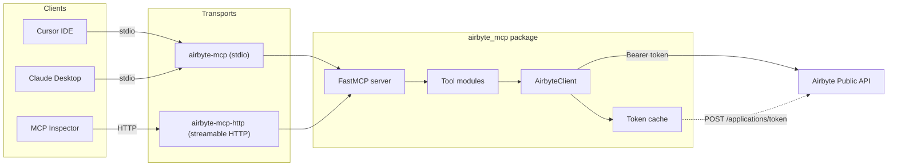

# Architecture

## Overview

`airbyte-mcp` is a Python MCP server built with [FastMCP](https://github.com/modelcontextprotocol/python-sdk) (the official MCP Python SDK). It exposes read-only tools that wrap the [Airbyte Public API](https://reference.airbyte.com/reference/getting-started).

## High-Level Flow



## Package Layout

```
src/airbyte_mcp/
├── __init__.py          # Package metadata
├── __main__.py          # python -m airbyte_mcp
├── server.py            # FastMCP instance + entry points
├── config.py            # pydantic-settings (env / .env)
├── client.py            # AirbyteClient (httpx + token lifecycle)
├── errors.py            # Centralised error formatting
├── formatters.py        # Markdown / JSON response helpers
└── tools/
    ├── __init__.py      # register_all(mcp)
    ├── health.py        # airbyte_health_check
    ├── workspaces.py    # airbyte_list_workspaces, airbyte_get_workspace
    ├── sources.py       # airbyte_list_sources, airbyte_get_source
    ├── destinations.py  # airbyte_list_destinations, airbyte_get_destination
    ├── connections.py   # airbyte_list_connections, airbyte_get_connection
    └── jobs.py          # airbyte_list_jobs, airbyte_get_job
```

## Token Lifecycle

1. On the first tool call, `AirbyteClient` exchanges `client_id` + `client_secret` for an access token via `POST /applications/token`.
2. The token is cached in memory with a 30-second safety margin before the reported `expires_in`.
3. Subsequent requests reuse the cached token.
4. If the token is expired (or the API returns `401`), the client automatically fetches a new one and retries the request once.

## Transport Modes

| Transport | Entry Point | Use Case |
|---|---|---|
| **stdio** | `airbyte-mcp` | Local dev, Cursor, Claude Desktop, Docker |
| **streamable HTTP** | `airbyte-mcp-http` | Remote access, cloud deployment, multiple clients |

Both entry points share the same FastMCP instance and tool registrations. The only difference is the transport layer.
