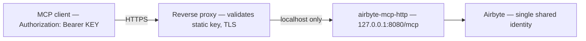

# Secure Remote / HTTP Design

This document describes the security posture of the **streamable-HTTP transport**
and the options for exposing it safely. It is **design only** — no remote
authentication is implemented yet.

## TL;DR

- The HTTP transport (`main_http`) has **no authentication**. Anyone who can
  reach the port can drive Airbyte using our single shared identity and our
  compute.
- **Do not expose it publicly as-is.** Keep it bound to `127.0.0.1` / localhost
  until real auth lands.
- Secure remote options (for later) are: (a) reverse proxy + static bearer/API
  key, (b) full OAuth 2.1 / OIDC, (c) network isolation / private-only access.

## The core risk

The server ships two transports (see [architecture.md](architecture.md)):

| Transport | Entry point | Default bind | Auth |
|---|---|---|---|
| stdio | `airbyte-mcp` | n/a (process pipe) | Inherited from local process |
| streamable HTTP | `airbyte-mcp-http` | `127.0.0.1:8080/mcp` | **None** |

The HTTP transport exposes the full MCP tool surface over the network with
**no authentication layer of its own**. There is no client identity, no token
check, and no per-request authorization at the MCP boundary. Concretely:

- **Single shared identity.** Every tool call authenticates to Airbyte with
  *one* set of credentials (OAuth client-credentials token exchange, or a static
  `AIRBYTE_ACCESS_TOKEN` — see [authentication.md](authentication.md)). Whoever
  reaches the port acts *as that identity* — listing, creating, updating,
  triggering syncs, and reading logs.
- **No per-user identity or audit.** Because there is only one downstream
  identity, actions cannot be attributed to individual callers. Airbyte's audit
  trail shows the shared application, not the human (or agent) behind the request.
- **Our compute, our blast radius.** Requests run on our host and consume our
  resources. A misbehaving or malicious client can drive Airbyte and our
  infrastructure at will.

If the port is reachable from an untrusted network (e.g. bound to `0.0.0.0`
without a firewall, or forwarded), this is effectively an unauthenticated remote
control plane for the connected Airbyte instance. **Do not expose it publicly
as-is.**

## Cloud / infra implications

Turning the HTTP transport into a genuinely shared remote service is not just a
code change — it has real operational and security costs:

- **Hosting cost.** A long-lived remote server is compute you pay for and must
  keep patched, monitored, and available.
- **Shared-identity credential blast radius.** One leaked or over-scoped
  credential set compromises *everything* that identity can touch in Airbyte.
  There is no per-caller scoping to contain damage.
- **No per-tenant isolation.** All callers share the same identity, workspace
  access, and process. One tenant can see and affect another tenant's Airbyte
  resources. True multi-tenant isolation requires real infrastructure —
  per-tenant credentials/identities, request-level authorization, and network
  or process separation.

This is precisely why Airbyte's own hosted **Agent MCP** is a *managed OAuth
product* rather than a bare HTTP server: safe multi-tenant remote access needs
an identity provider, per-user tokens, and isolation that a single-process,
single-credential server cannot provide.

## Secure options for later (design only)

The following are candidate designs. None are implemented here; they are
documented so the trade-offs are clear before any future work.

### (a) Reverse proxy + static bearer / API key

Put a reverse proxy (nginx, Caddy, Traefik, or a cloud API gateway) in front of
the HTTP transport, keep the MCP server bound to localhost, and require a static
bearer token or API key at the proxy.

- **Pros:** simplest to add; TLS termination and rate limiting come for free at
  the proxy; no MCP code changes.
- **Cons:** still a *shared* secret and a *shared* downstream identity — it gates
  access but gives no per-user identity, audit, or tenant isolation. Rotate the
  key carefully; a leak grants full access.

### (b) Full OAuth 2.1 / OIDC

Front the transport with a real identity provider (Keycloak-style, mirroring
Airbyte's hosted MCP). Callers authenticate against the IdP and present
per-user access tokens; the server validates them before serving MCP requests.

- **Pros:** per-user identity, real authorization, token expiry/revocation, and
  the foundation for auditability and (with more work) multi-tenant scoping.
- **Cons:** requires standing up and operating an IdP; the most work of the three
  options. This is the path to a genuinely shareable remote service.

### (c) Network isolation / private-only access

Never expose the port to untrusted networks. Reach it only over a VPN, private
subnet / VPC, SSH tunnel, or service mesh with mTLS between known peers.

- **Pros:** strong perimeter with no application-layer auth changes.
- **Cons:** access is coarse (network membership, not user identity); still a
  shared identity behind the perimeter, so it complements — but does not replace
  — (a) or (b).

## Recommendation

Until authentication lands, **keep the remote transport bound to `127.0.0.1` /
localhost** (the default). Do not bind to `0.0.0.0` or forward the port to an
untrusted network. If remote access is genuinely needed in the short term,
combine network isolation (c) with a reverse-proxy key (a) as a stopgap, and
plan for OAuth 2.1 / OIDC (b) before offering it as a shared service.
